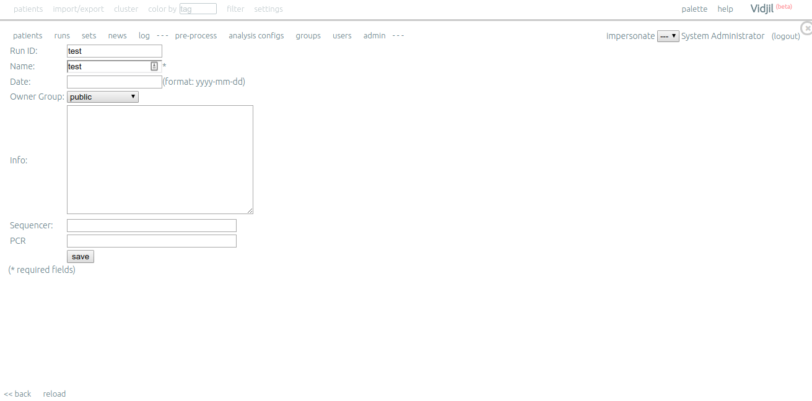
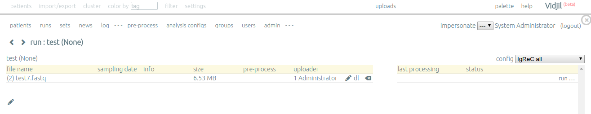
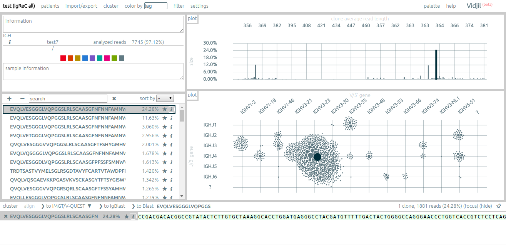

# Deploying vidjil-server with IgReC support

IgReC (IgRepertoireConstructor, http://cab.spbu.ru/software/y-tools/) is a tool constructing an antibody/T-cell repertoire from Rep-Seq data.

The latest version of IgReC supports vidjil output format https://gitlab.inria.fr/vidjil/vidjil/blob/dev/doc/format-analysis.org,
therefore, it is possible to run the IgReC algorithm on the vidjil-server web platform http://www.vidjil.org/.

Unfortunately, for this moment (10 July 2018) the official vidjil-server instance does
not provide IgReC running for public users due to highly limited resources.

However, you can deploy your own vidjil server instance with IgReC support using the manual below.

## Prerequisites and requirements:
1. Installed docker https://www.docker.com/ and user having the rights to run docker containers.
Consult the server administrator in case of using corporate server.
For testing purposes almost any platform supporting docker is OK, but for production it is
highly recommended to use an officially compatible platform; consult https://success.docker.com/article/compatibility-matrix.
2. Docker-compose https://docs.docker.com/compose/ package. It is highly recommended to use the latest version.

## Installation:
1. Clone this repo and go to the `docker` directory

2. Check the volume mount paths in `docker-compose.yaml`. You can use any other paths for database, logs, etc.
Paths should referer empty (or not exist) directories.
Be careful, with default settings Docker mounts and accesses volume dirs with ROOT privileges even if the containers are started by
an unprivileged user. It could corrupt or destroy your (and not only your!) data.

3. In case of running non-locally, change the hostname in `vidjil/conf/conf.js` from `localhost` to your server hostname or IP.


4. Change the listened HTTP/HTTPS port numbers if necessary. The current port numbers are 3680/36443.
* HTTP port 3680 -> YOUR_HTTP_PORT in `vidjil/conf/nginx_web2py` and `docker-compose.yml`;
* HTTPS port 36443 -> YOUR_HTTPS_PORT in `vidjil/conf/nginx_web2py`, `vidjil/conf/conf.js`, and `docker-compose.yml`.
On a server the ports could be already occupied by other services and users.
Consult the administrator about free ports and port using policy.


5. Build the images
```
docker-compose build
```

6. Run the service
```
docker-compose up
```

7. Connect to https://YOUR_SERVER_NAME_OR_IP:YOUR_HTTPS_PORT/browser using web-browser. Accept the untrusted certificate.
Press `init database` and create a new user. Be careful, the server accepts only passwords >= 8.
Access admin interface and create other users if necessary. Check their permissions.

8. To stop running service press <CTRL+C>

## Usage example
1. Create new run `runs -> + new run`.

2. Click on the created run and then `+ add sample`.
3. Select `my computer`, then `choose file` and upload a file with merged Rep-Seq reads. Press `Submit`.
4. Select the config ('IgReC all' for all immune receptors, IgReC Ig for BCRs) and press `run`.

5. Wait a time.
6. Inspect the result.



For additional vidjil-server options consult the manual on http://www.vidjil.org/.

## Demonizing
You can run the service in detached (demonized) mode and close the terminal leaving working service
```
docker-compose up -d
```
To stop detached service run
```
docker-compose stop
```
inside the `docker` directory.

## Firewalls and other network issues
Your server could block connections to your ports. If you have ssh access, you can can use ssh forwarding
```
ssh -C -q -N -o ServerAliveInterval=60 YOUR_SERVER -L 36443:localhost:36443 -L 3680:localhost:3680
```
And connect to https://localhost:36443 on your local machine.
In this case you should not change the server hostname in `vidjil/conf/conf.js, let it be `localhost`.
Be careful, ssh port forwarding may be disabled as well, consult the server administrator.
